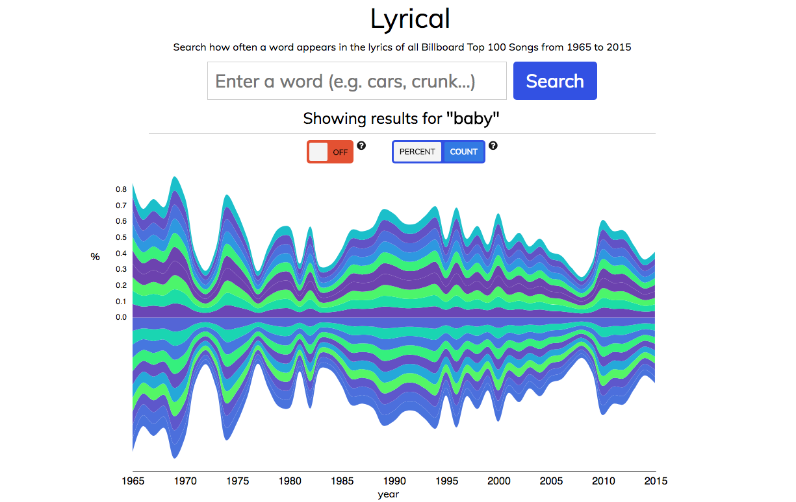

# Lyrical
An app for visualizing the popularity of words in lyrics over the past 50 years.

[Live](https://tassosb.github.io/lyrical/)



## Data
The dataset was gathered by [walkerkq](https://github.com/walkerkq) and can be found in full [here](https://github.com/walkerkq/musiclyrics). Some work was done to prepare the data for counting the frequency of words in lyrics. First, the original csv file was converted to json. Then any punctuation was removed under the assumption that users do not want to consider differences in punctuation when inputting search terms.

The data is stored as an array of objects, each object holding the information a song. In order to minimize file size, the a song's lyrics are stored as an object that holds the counts of each unique word. This cuts the size of bundle.js in half because duplicate words, common in song lyrics, are not repeated.

## Counting
The `WordCounter` class exposes a simple interface for counting words in the lyrics dataset. This object-oriented approach encourages loosely coupled code and convenient ways to implement caching. Only one `WordCounter` object is instantiated in a given session. A `WordCounter` instance holds a `cache` attribute, which it looks into every time before executing a count from scratch. Additionally, it holds a reference to the results of the last count made, and the targets of that count.

```
#js/word_counter.js

count (word) {
  if (word) this.targets = this.expandTarget(word);
  this.current = this.newCount();

  return this.output();
}
```

It is common for 'ing' verbs to be written in song lyrics as verb + 'in'. For example, 'singing' will often be written as 'singin'. The word counter accommodates for this colloquialism by expanding the target of the count in the case of a verb ending in 'ing'. Other variables are taken into consideration, for example all words are down cased and punctuation is removed. The motivation is to make it as easy as possible for the user to make a meaningful query.

```
#js/word_counter.js

expandTarget(word) {
  const targets = [removePunctuation(word.toLowerCase())];
  if (word.slice(0, -3).search(/[aeiou]/) >= 0) {
    if (word.slice(-3) === "ing")
      targets.push(word.slice(0, -1));
  }
  return targets;
}
```

## Graph
The `StreamGraph` class dynamically renders a graph inside of a SVG element using the D3.js library. The rendering logic is composed of modular methods following the single responsibility principle. The API is very basic. After initializing a `StreamGraph` instance with an HTML Element, initial data, and other parameters, a user can can set new data with `#setData`.
```
#js/streamgraph.js

setData (newData) {
  this.data = newData;

  this.createLayers();
  this.createScales();
  this.addAxes();

  this.transition();
}
```
DRY Code is achieved by following principles of object-oriented design, made easier by ES6 syntax. Frequently used values are easy to refer to as instance attributes.

## Input Validation
To help users focus on meaningful queries, Lyrical checks the existence of user input in the lyrics dataset. More specifically, it will provide feedback when the current input will surely not lead to a word in the dataset. For example, "lov" will lead to a valid input, like "love", but "lovg" surely will not. Input is validated again each time the user types a new character to offer real-time feedback.

A naive approach to this validation is to iterate over the entire dataset each time, checking for matches. With a dataset of many thousands of words, this approach is expensive. Feedback may not get rendered in time before the user begins typing again.

To achieve the desired feature of real-time input validation, Lyrical builds a trie data structure with the lyrics dataset upon instantiating App. The trie is a basic poly tree in which the value of each node is a letter. Words are formed by tracing down from the root node.
For example, this simple trie:
```
           *
          / \
         a   t
        / \   \
       r   n   e
      /   / \   \
     t   t   d   a
```
contains the words "art", "ant", "and", "tea".
With this data structure in place, validating user input can be done as few operations as letters in the inputted text.

```
#js/input_validator.js

validate (input) {
  let curr = this.root;

  for (let i = 0, n = input.length; i < n; i++) {
    curr = Trie.validate(curr, input[i].toLowerCase())
    if (!curr) return false;
  }

  return true;
}

#js/util/trie.js

static validate(node, value) {
  let match = node.children[value];
  return match || null;
}
```

## Interface
The interface was built to be as simple as possible. However it does offer options to view the data in different ways. The entire interface is built with HTML, CSS, and native DOM manipulation. An emphasis was made on clarity and ease of use. The search input field at the top of the page is the main interactive feature, and offers endless ways for the user to engage with the data.
